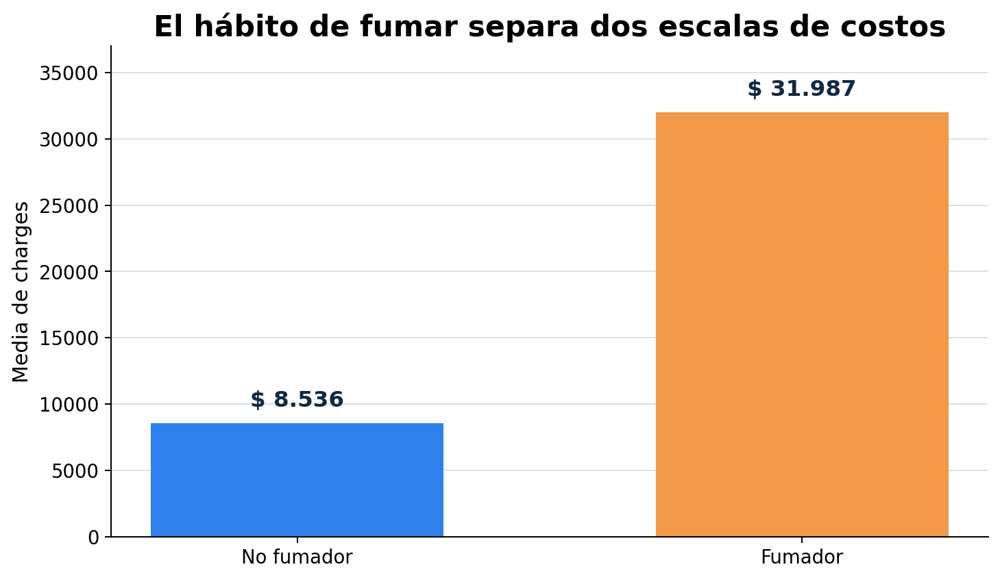
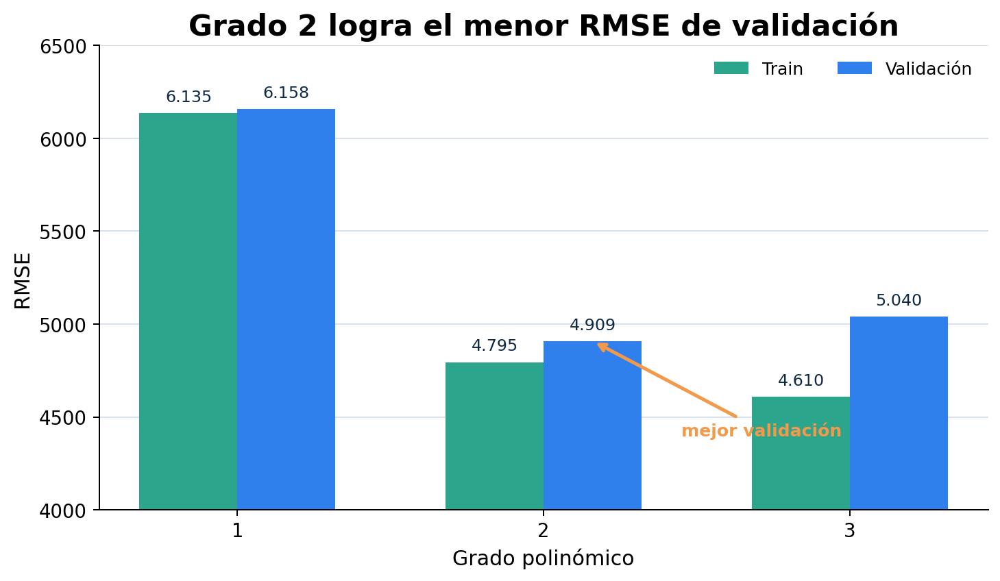
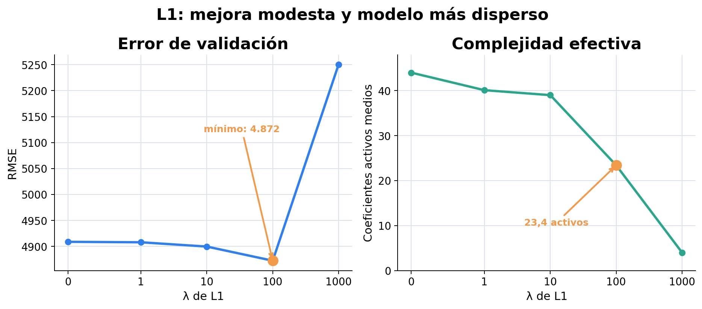

## Problema y datos

:::: {.columns}
::: {.column width="42%"}
**Objetivo:** predecir el costo anual `charges`.

**1.338** casos originales  
**1.337** casos únicos

**1.203** desarrollo · 90 %  
**134** test · 10 %
:::
::: {.column width="58%"}
- Numéricas: `age`, `bmi`, `children`.
- Categóricas: `sex`, `smoker`, `region`.
- Quitamos una copia exactamente duplicada.
- Estratificamos por `smoker`.
- Semilla reproducible: 42.

*[P01, pp. 1–2] [D01]*
:::
::::

## Train, validación y test

**Train** → aprende parámetros  
**Validación** → elige grado y λ  
**Test** → estima una vez el rendimiento final

Usamos **10-fold cross-validation** sólo sobre desarrollo:

> Cada caso participa una vez en validación y nueve veces en entrenamiento.

El preprocesamiento se ajusta dentro de cada fold. Así evitamos que validación o test informen al modelo durante el entrenamiento.

*[T02, pp. 85, 89, 94–96] [T03, pp. 12, 15]*

## Qué encontramos en el EDA

:::: {.columns}
::: {.column width="58%"}
{width=100%}
:::
::: {.column width="42%"}
- Sin faltantes ni categorías inesperadas.
- Los `charges` altos pertenecían principalmente a fumadores.
- IQR por grupo mostró dos distribuciones distintas.
- Conservamos outliers plausibles y las seis variables.

*[T02, pp. 39–42]*
:::
::::

## Pipeline y métrica

:::: {.columns}
::: {.column width="57%"}
**Dentro de cada fold:**

1. Numéricas → estandarización.
2. Categóricas → one-hot.
3. Polinomio → grados 1, 2 o 3.
4. Para L1 → escalar los términos.
5. Regresión → ajustar coeficientes.
:::
::: {.column width="43%"}
**RMSE**

Raíz del promedio de los errores cuadrados.

- Mismas unidades que `charges`.
- Penaliza más los errores grandes.
- Se calcula en train y validación.

*[T02, p. 52] [T03, p. 87]*
:::
::::

## ¿Qué grado generaliza mejor?

:::: {.columns}
::: {.column width="66%"}
{width=100%}
:::
::: {.column width="34%"}
- Grado 2 mejora aproximadamente 20 % frente al lineal.
- Grado 3 baja train, pero empeora validación.
- La brecha crece de 114 a 430.

**Señal de complejidad excesiva.**

*[T02, pp. 52–53, 76–77]*
:::
::::

## Regularización L1

:::: {.columns}
::: {.column width="66%"}
{width=100%}
:::
::: {.column width="34%"}
**Error cuadrático + penalización L1**

- Elegimos **λ = 100** por validación.
- Mejora modesta: 0,74 %.
- Reduce coeficientes activos.
- λ = 1000 subajusta.

*[T03, p. 90]*
:::
::::

## Modelo seleccionado

:::: {.columns}
::: {.column width="50%"}
### Grado 2 + L1 + λ = 100

**4.847,19** · train final  
**4.872,42 ± 776,46** · validación CV  
**3.957,83** · test independiente
:::
::: {.column width="50%"}
- Reentrenamos con 1.203 casos.
- Quedaron 22 de 44 coeficientes.
- Test se consultó una sola vez.
- No retocamos el pipeline después.

*[P01, pp. 2–3] [T02, pp. 88–89]*
:::
::::

## Conclusiones

1. **Menor error:** grado 2 con L1 y λ = 100.
2. **Modelo para una aplicación:** el mismo; mejora al lineal y evita la brecha del grado 3.
3. **RMSE a comunicar:** 3.957,83 sobre test independiente.

**Cautela:** test contiene sólo 134 casos. El resultado fue más favorable que el promedio de validación, por lo que es una estimación y no una garantía exacta.

**Idea central:** elegimos con validación; estimamos generalización con test.

## Apéndice · ¿Qué se optimizó?

:::: {.columns}
::: {.column width="50%"}
**Regresión lineal / polinómica sin L1**

- Minimiza la suma de residuos cuadrados.
- La regresión sigue siendo lineal en los coeficientes aunque las entradas tengan potencias e interacciones.
:::
::: {.column width="50%"}
**Lasso**

- Minimiza error cuadrático + penalización L1.
- `scikit-learn` llama `alpha` al λ de nuestra presentación.
- Usa descenso por coordenadas.
- Con λ = 100 quedaron 22 coeficientes activos.

*[T02, pp. 49–52] [T03, p. 90]*
:::
::::

## Apéndice · Decisiones defendibles

:::: {.columns}
::: {.column width="50%"}
**¿Por qué 10 % para test?**  
Priorizamos desarrollo para entrenar mejor en cada fold; aceptamos mayor variabilidad final.

**¿Por qué estratificar por smoker?**  
Es la variable que más separa `charges`; estabiliza su proporción sin usar el objetivo para formar los grupos.
:::
::: {.column width="50%"}
**¿Por qué conservar outliers?**  
Eran plausibles y estructurales, no errores de carga. Quitarlos habría cambiado la población objetivo.

**¿Por qué ajustar escalado dentro del fold?**  
Para impedir leakage desde validación hacia entrenamiento.
:::
::::
