# TP2 paso a paso: guía de estudio para la defensa

Esta guía recorre la resolución del TP2 (Bank Marketing) en el orden en que se hizo. En cada paso conecta la decisión con la teoría de la materia y explica el concepto. No reemplaza a la entrega: los números salen del notebook `entregas/tp2-bank-marketing/tp2_bank_marketing.ipynb`, y las justificaciones completas están en `entregas/tp2-bank-marketing/decisiones.md`.

**Cómo leerla.** Cada sección tiene tres partes:

- **Qué hicimos:** la decisión o el resultado.
- **Teoría:** el concepto de clase que lo justifica, con su cita.
- **Para la defensa:** la frase que conviene poder decir de memoria.

Al final hay preguntas de autoevaluación con respuestas plegadas.

Los diagramas usan Mermaid. GitHub los muestra como gráficos; en VS Code hace falta una extensión de vista previa de Mermaid.

---

## 0. Mapa del TP

El hilo conductor es **qué datos se usan en cada etapa**, que es lo que la consigna pide dejar claro. [P02, p. 3]

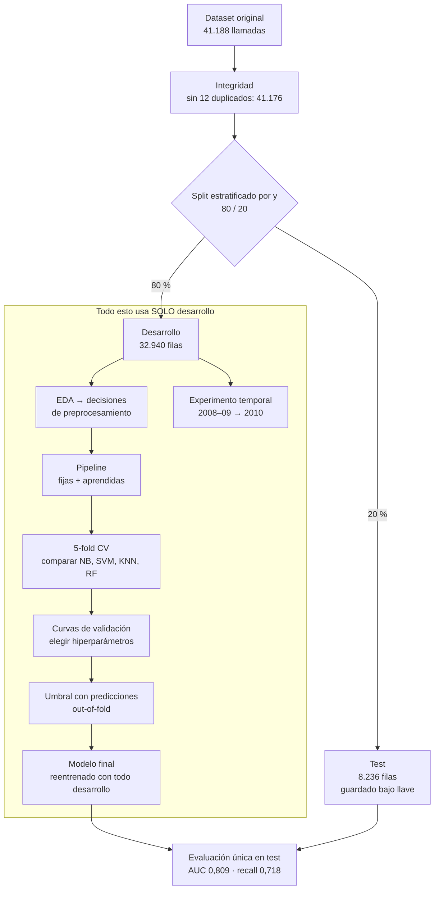

**Para la defensa:** "Elegimos todo con desarrollo y validación cruzada. Test lo abrimos una sola vez, con el modelo ya congelado." [T02, p. 89]

---

## 1. El problema

**Qué hicimos.** Predecir si un cliente contrata un plazo fijo (`y = yes/no`) a partir de datos demográficos, de campañas anteriores y del contexto económico. El uso real es **priorizar a quién llamar**. [P02, p. 1]

> **Teoría: aprendizaje supervisado y clasificación.** El modelo aprende un mapeo de entradas a una salida a partir de ejemplos etiquetados. [T01, p. 25] Si la salida es una categoría, el problema es de clasificación; acá es binaria.

El dato que condiciona todo el TP es que **solo el 11,3 % respondió que sí**: las clases están desbalanceadas.

> **Teoría: la trampa de la accuracy.** La accuracy no dice qué tipo de error comete el modelo. [T04, p. 26] [T04, p. 27] Un modelo que siempre responde "no" acierta el 88,7 % sin encontrar a ningún interesado.

**Ejemplo para fijar.** Nuestro modelo final tiene **menos** accuracy en test que "siempre no": 77,9 % contra 88,7 %. Igual es muchísimo más útil, porque encuentra al 72 % de los interesados y "siempre no" no encuentra a ninguno. Por eso la accuracy no es una de nuestras métricas.

---

## 2. Integridad de los datos

**Qué hicimos.**

| Hallazgo | Decisión | Por qué |
|---|---|---|
| 12 filas duplicadas exactas | Eliminarlas antes del split. | Si una copia cae en entrenamiento y otra en validación o test, el modelo "ya vio" ese caso y la estimación queda optimista. |
| Los faltantes vienen como `unknown`, no como NaN. [D03] | Contarlos a mano. | `isna()` no los detecta. `default` tiene 20,8 % de `unknown`. |
| `pdays = 999` significa "no contactado antes". [D03] | Revisarlo como código, no como número. | Un 999 no es "muchos días": es una etiqueta. |

**Para la defensa:** "Los duplicados los sacamos antes de separar, por la misma razón que en el TP1: evitar que el mismo caso aparezca de los dos lados."

---

## 3. Primera decisión fuerte: cómo separar test

**Qué encontramos.** La documentación dice que las filas están **ordenadas por fecha**, de mayo de 2008 a noviembre de 2010. [D03] Con esa información reconstruimos el año y vimos que la tasa de éxito cambia muchísimo:

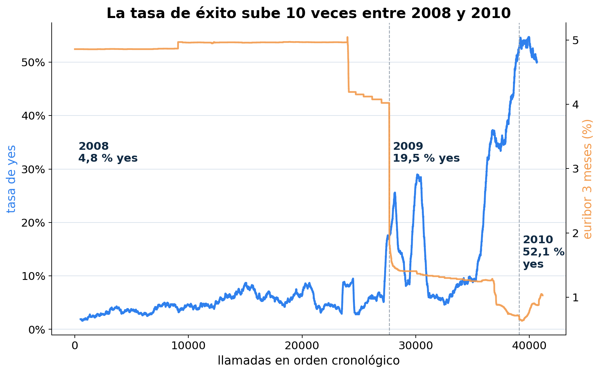

| Año | Filas | Tasa de `yes` |
|---|---:|---:|
| 2008 | 27.682 | 4,8 % |
| 2009 | 11.436 | 19,5 % |
| 2010 | 2.058 | 52,1 % |

Las cinco variables macroeconómicas solo tienen 375 combinaciones distintas: funcionan como un **reloj** que indica el período de la llamada.

**Las dos opciones que comparamos:**

| Estrategia | Desarrollo (80 %) | Test (20 %) |
|---|---|---|
| **Aleatoria estratificada (elegida)** | Mezcla de 2008 a 2010 · 11,3 % de `yes` | Mezcla de 2008 a 2010 · 11,3 % de `yes` |
| Temporal (descartada) | Las primeras filas, el "pasado" · 6,4 % de `yes` | Las últimas filas, el "futuro" · 30,8 % de `yes` |

> **Teoría: roles de las particiones.** Train aprende parámetros, desarrollo elige el modelo y test estima una vez el rendimiento final. [T02, p. 89] Test tiene que ser independiente y representar la población donde se usará el modelo. [T02, p. 69]

**Por qué elegimos el aleatorio:**

1. La consigna pide k-fold cross-validation, que supone que las filas son intercambiables. [P02, p. 2]
2. Con un split temporal, test tendría entre 31 y 46 % de positivos contra 6–7 % en desarrollo. La métrica final mezclaría la calidad del modelo con un cambio fuerte de distribución.
3. **Estratificar por `y`** mantiene el 11,3 % en ambos conjuntos. Elegimos 20 % para test (y no 10 % como en el TP1) para tener unos **928 positivos** con los que estimar el recall de forma estable.

**El costo, que lo decimos nosotros antes de que lo pregunten:** la estimación de test supone clientes parecidos a la mezcla de 2008 a 2010, así que es **optimista para campañas futuras**. Lo medimos al final, en la sección 11.

---

## 4. EDA: cada observación termina en una decisión

La consigna lo exige: el EDA "debe utilizarse para tomar decisiones concretas". [P02, p. 1] Se hizo **solo con desarrollo**.

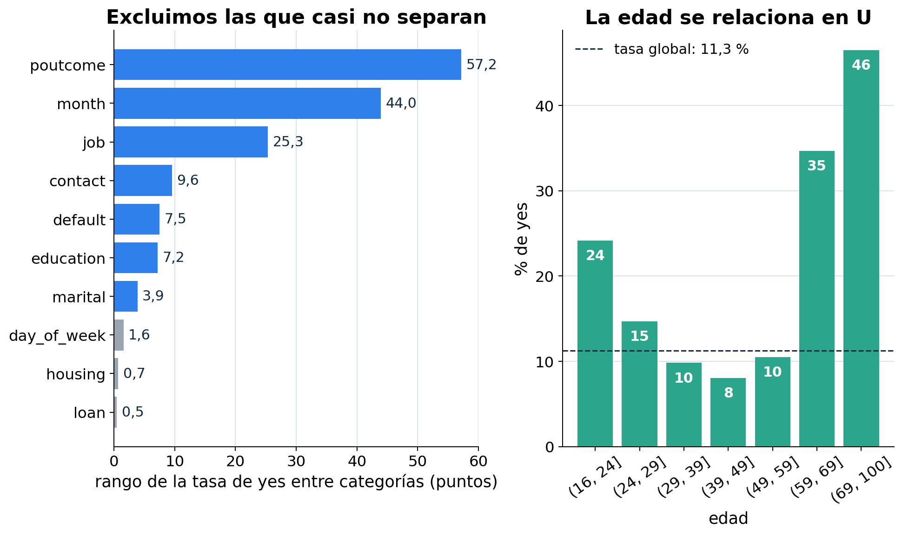

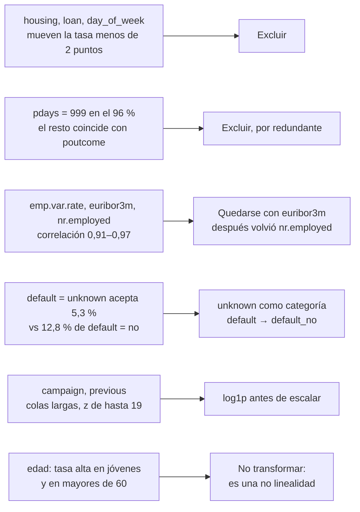

### 4.1 Por qué excluir variables "sin información"

> **Teoría: dimensionalidad.** Agregar variables irrelevantes suma ruido y riesgo de sobreajuste. En alta dimensión, las distancias pierden capacidad de discriminar. [T03, p. 59] En KNN todas las variables entran en la distancia, incluso las poco informativas. [T09, p. 39]

**Idea clave:** que una variable no sirva **no es neutral para KNN**: suma ruido a cada distancia. Por eso la verificación posterior (sección 4.5) mostró que agregar `housing`, `loan` y `day_of_week` **empeora** KNN (−0,008 de AUC).

### 4.2 Variables correlacionadas

> **Teoría: Naive Bayes y la independencia condicional.** Naive Bayes supone que los atributos son independientes dada la clase. [T06, p. 38] Si dos variables miden casi lo mismo, el modelo cuenta dos veces la misma evidencia. La clase 7 recomienda quitar variables correlacionadas y conservar una. [T07, p. 72]

### 4.3 `unknown` como categoría y `default_no`

- `unknown` no es ruido: en `default`, los clientes con dato desconocido aceptan 5,3 % y los que no están en mora, 12,8 %. Eliminar esas filas tiraría el 21 % de los datos, e imputar con la moda borraría la señal.
- `default = yes` tiene **2 filas** en desarrollo, y ningún modelo aprende algo de 2 ejemplos. La variable pasa a ser binaria: **"consta que no está en mora"** (1 si `no`, 0 si `unknown` o `yes`). El `yes` se agrupa con `unknown` porque un cliente en mora no puede quedar del lado de "consta que no".

> **Teoría: codificación de categóricas.** One-hot crea una columna indicadora por categoría y puede aumentar mucho la dimensionalidad. [T02, p. 18]

### 4.4 `log1p` y escalado

> **Teoría: escalado.** Las diferencias de escala afectan a algunos modelos. El z-score, `(x − μ) / σ`, es la opción por defecto para muchos de ellos. [T03, p. 40] [T03, p. 43] SVM y KNN usan distancias o productos internos: una variable con valores grandes domina. [T08, p. 54] [T09, p. 32]

**Ejemplo para fijar.** `campaign` (llamadas en esta campaña) va de 1 a 56. Al estandarizar, el cliente de 56 llamadas queda en z ≈ 19. En una distancia euclídea, esa sola variable aporta 19² ≈ 360, frente a alrededor de 1 de cada una de las otras. `log1p(x) = log(1 + x)` comprime la cola: 1 → 0,69, 3 → 1,39 y 56 → 4,04. Después de escalar, el máximo baja a z ≈ 6.

- No aprende parámetros, así que **no genera leakage**.
- No cambia el orden de los valores, así que **a Random Forest le da igual**: sus cortes solo dependen del orden.

### 4.5 Verificamos las exclusiones (y corregimos una)

La consigna sugiere comparar el desempeño "con y sin ciertas variables problemáticas". [P02, p. 1] Agregamos cada grupo excluido por separado y medimos el cambio de AUC:

| Grupo agregado | NB gaussiano | NB categórico | RF | KNN |
|---|---:|---:|---:|---:|
| `pdays` | +0,000 | 0,000 | −0,001 | 0,000 |
| `housing`, `loan`, `day_of_week` | −0,001 | 0,000 | +0,007 | **−0,008** |
| `nr.employed` | **+0,007** | **+0,004** | 0,000 | 0,000 |

**Lectura:** `nr.employed` aportaba información propia a pesar de su correlación con `euribor3m`, así que **la reincorporamos**. Es un buen ejemplo de que el EDA propone y la validación decide.

---

## 5. Leakage: dos formas distintas

> **Teoría: data leakage.** Es usar, al entrenar o al tomar decisiones de desarrollo, información que no debería estar disponible. Si la limpieza, la imputación, el encoding, el escalado o la selección se aprenden con todo el dataset, test deja de ser independiente. [T02, p. 94] [T02, p. 96]

### 5.1 Leakage por la variable: `duration`

`duration` es la duración de la llamada. Se conoce **al terminarla**, cuando ya se sabe la respuesta. La documentación recomienda descartarla en un modelo realista. [D03] La consigna pide analizar justamente esto. [P02, p. 1]

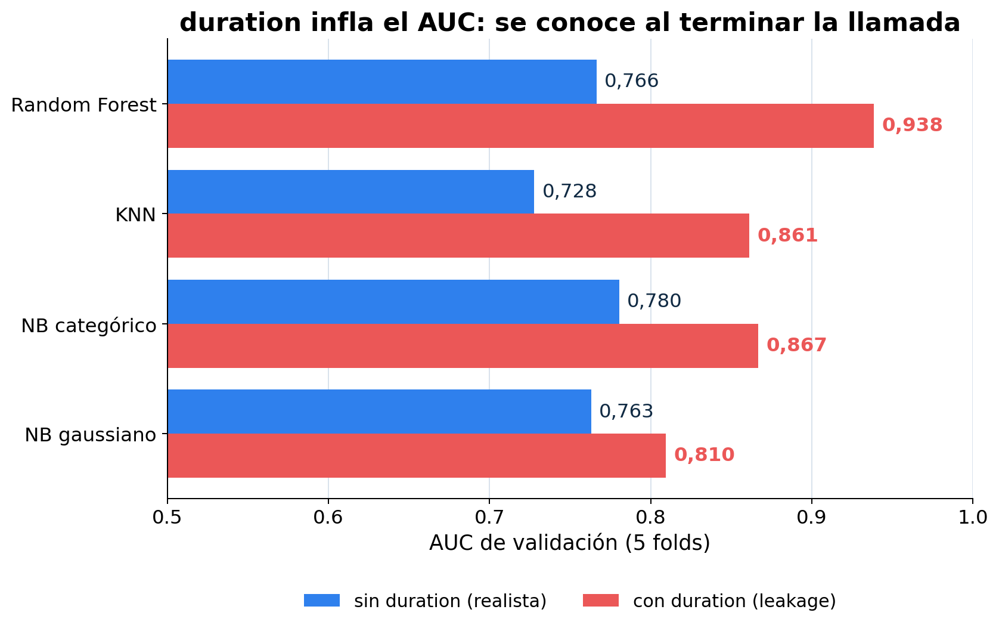

Con `duration`, Random Forest pasa de 0,766 a **0,938** de AUC. El número es espectacular y falso: ese modelo no puede usarse en el momento en que hay que decidir a quién llamar.

### 5.2 Leakage por el preprocesamiento: el pipeline

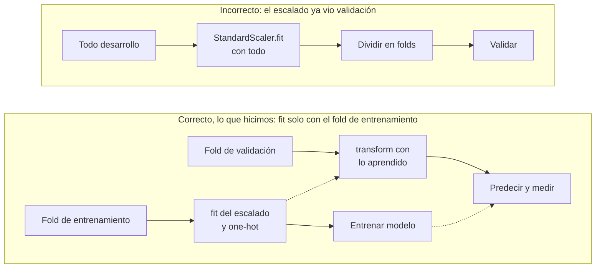

En el caso incorrecto, la media y el desvío del escalado ya "vieron" el fold de validación. El pipeline de scikit-learn lo resuelve: `cross_validate` vuelve a ajustar todo el pipeline en cada fold.

**Dos tipos de transformaciones en nuestro pipeline:**

| Tipo | Ejemplos | ¿Aprende de los datos? | ¿Riesgo de leakage? |
|---|---|---|---|
| Fijas | Excluir columnas, `default_no`, agrupar `illiterate`, `log1p` | No | No |
| Aprendidas | `StandardScaler`, `OneHotEncoder`, discretización por cuantiles | Sí | Sí, por eso van dentro de cada fold |

---

## 6. Validación cruzada

> **Teoría: k-fold.** Se divide desarrollo en `k` bloques. Cada bloque valida una vez y los otros `k − 1` entrenan. Todas las observaciones participan una vez en validación. [T03, p. 12] [T03, p. 15] El material menciona `k = 5` o `10` como valores usuales. [T02, p. 85]

| | Bloque 1 | Bloque 2 | Bloque 3 | Bloque 4 | Bloque 5 |
|---|:---:|:---:|:---:|:---:|:---:|
| Fold 1 | **VAL** | train | train | train | train |
| Fold 2 | train | **VAL** | train | train | train |
| Fold 3 | train | train | **VAL** | train | train |
| Fold 4 | train | train | train | **VAL** | train |
| Fold 5 | train | train | train | train | **VAL** |

Cada fila es un ajuste completo del pipeline: se entrena con los cuatro bloques `train` y se mide en el bloque `VAL`. El resultado reportado es el promedio (± desvío) de los 5 folds.

- **Estratificado:** cada fold conserva el 11,3 % de positivos, unos 742 por fold.
- **Por qué 5 y no 10:** con 33 mil filas alcanza, y SVM tarda hasta 3 minutos por ajuste.
- **Predicciones out-of-fold:** cada cliente de desarrollo recibe el score del modelo que **no lo vio**. Juntando los 5 folds, todos los clientes tienen una predicción honesta. Con eso elegimos el umbral (sección 7).

---

## 7. Métricas: AUC, recall y el umbral

### 7.1 Matriz de confusión

> **Teoría.** La matriz cruza la predicción con el valor real. [T04, p. 28] [T04, p. 29]

Matriz de nuestro modelo final en test:

| | Real: yes | Real: no |
|---|---:|---:|
| **Llamar** | TP = 666 | FP = 1.555 |
| **No llamar** | FN = 262 | TN = 5.753 |

| Métrica | Fórmula [T04, p. 31] [T04, p. 35] | Cuenta | Valor | Qué significa |
|---|---|---|---:|---|
| Recall | TP / (TP + FN) | 666 / 928 | **0,718** | De los interesados, encontramos al 72 %. |
| Precisión | TP / (TP + FP) | 666 / 2.221 | 0,300 | El 30 % de las llamadas termina en contratación. |
| Especificidad | TN / (TN + FP) | 5.753 / 7.308 | 0,787 | Al 79 % de los no interesados no los llamamos. |
| FPR | FP / (FP + TN) | 1.555 / 7.308 | 0,213 | `1 − especificidad`. |

**Truco para no confundirse:** precisión se lee por **fila** (parte de lo que dijo el modelo); recall y especificidad, por **columna** (parten de lo que es en realidad).

### 7.2 Por qué AUC y recall

- **AUC.** El objetivo es **ordenar** clientes para priorizar llamadas. La curva ROC recorre todos los umbrales y grafica `(FPR, TPR)`. [T04, p. 45] El área vale 1 para un clasificador ideal y 0,5 para uno al azar. [T04, p. 50] [T04, p. 51] No depende del umbral, así que sirve para **comparar modelos**.
- **Recall.** Perder a un interesado (FN) cuesta más que una llamada de más (FP). Es el mismo razonamiento que el ejemplo de cáncer de la clase 4, donde el FN es el error grave. [T04, p. 41]
- **F1** aparece en la lista de métricas de la clase, pero no se desarrolla. [T04, p. 24] Además pesa igual precisión y recall, y nosotros priorizamos recall.

### 7.3 El umbral: de un score a una decisión

> **Teoría.** El modelo devuelve un score, y el umbral que lo convierte en sí o no lo elegimos nosotros. Bajarlo sube el recall y baja la precisión. [T04, p. 38] [T04, p. 39] [T04, p. 40] Un criterio práctico es elegir el punto de la curva ROC más cercano a `(0, 1)`. [T04, p. 52]

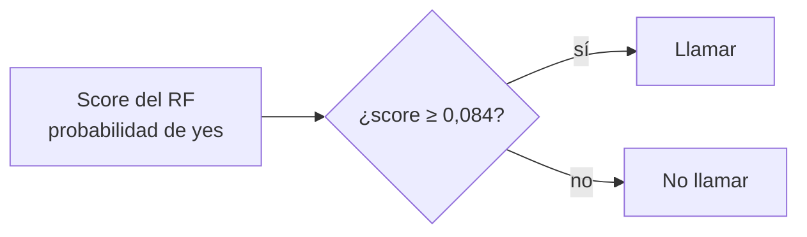

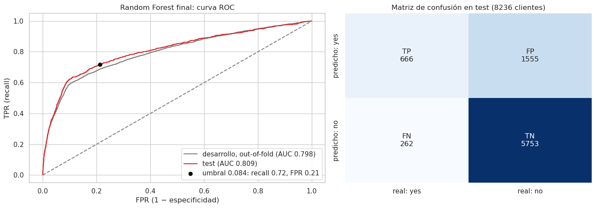

**Por qué 0,084 y no 0,5.** Con 11 % de positivos, el Random Forest rara vez da probabilidades altas. Con el umbral 0,5, el recall sería **0,23**: se escaparían tres de cada cuatro interesados. El punto elegido, con FPR 0,21 y recall 0,72, está a distancia √(0,213² + 0,282²) ≈ 0,35 de `(0, 1)`.

**Por qué no es leakage elegir el umbral así.** Se eligió con las predicciones out-of-fold **de desarrollo** y se fijó antes de mirar test. Es un hiperparámetro más.

---

## 8. Los cuatro modelos: cómo funcionan y qué nos pasó con cada uno

La consigna pide entender cómo funcionan para explicar los resultados. [P02, p. 2]

### 8.1 Naive Bayes: un modelo generativo

> **Teoría.** Un modelo generativo aprende cómo se distribuye cada clase, `P(x | y)` y `P(y)`, y clasifica con Bayes: `posterior ∝ prior · verosimilitud`. [T06, p. 3] [T06, p. 16] Naive Bayes agrega la independencia condicional de los atributos dada la clase: `P(a₁, …, aₙ | v) = Π P(aᵢ | v)`. [T06, p. 35] [T06, p. 38]

| Variante | Cómo modela cada atributo | Qué pasó |
|---|---|---|
| Gaussiano | Una normal por clase, con covarianza diagonal. [T06, p. 22] [T06, p. 32] | AUC 0,763. 39 de las 46 columnas son binarias, no gaussianas, y sus probabilidades son extremas: el umbral quedó en 0,0002. |
| Categórico | Frecuencias por clase, con corrección de Laplace (`alpha = 1`). [T06, p. 43] [T06, p. 44] | AUC 0,780 con un gap mínimo (0,013). Discretizamos las numéricas en 5 cuantiles por fold. |

**Por qué Laplace.** Si un valor nunca aparece con una clase en entrenamiento, su frecuencia es 0 y anula toda la productoria. [T06, p. 42]

**Para la defensa:** "Los supuestos no se cumplen del todo: hay variables correlacionadas y binarias no gaussianas. Aun así, el categórico es un modelo simple que casi no sobreajusta."

### 8.2 KNN: aprender de memoria

> **Teoría.** KNN es perezoso: no construye un modelo, guarda los datos y al predecir busca los `k` más cercanos. [T09, p. 10] [T09, p. 18] Supone **continuidad local**: clientes parecidos se comportan parecido. [T09, p. 9] Un `k` chico tiene bajo sesgo y alta varianza; uno grande, lo contrario. [T09, p. 29] La ponderación por distancia hace que cada vecino pese la inversa de su distancia. [T09, p. 34]

**Qué nos pasó:**

- Con `k = 5` (por defecto), el AUC era 0,928 en train y 0,728 en validación: sobreajuste.
- El mejor `k` fue **321**, el 1,2 % de los 26 mil clientes de entrenamiento de cada fold.
- **¿Por qué tan grande?** Sin `duration`, el 20,5 % de los clientes comparte exactamente sus predictores con otro, y 1.067 tienen un "gemelo" con la respuesta opuesta. Las clases están muy superpuestas: un vecindario chico es ruido.
- **Ponderación por distancia:** train da 0,999, porque cada punto de train es su propio vecino a distancia 0 con peso máximo. Memoriza, y en validación rinde peor (0,748 contra 0,782).
- **Costo:** predecir exige calcular distancias a todo el entrenamiento. [T09, p. 38]

### 8.3 SVM: el margen y el desbalance

> **Teoría.** SVM busca el hiperplano que separa las clases con **margen máximo**. Ese hiperplano depende solo de los vectores de soporte. [T08, p. 10] [T08, p. 19] [T08, p. 23] El margen tolerante permite violaciones. [T08, p. 29] [T08, p. 30] Los kernels permiten fronteras no lineales; RBF da fronteras locales. [T08, p. 46] [T08, p. 47] El score `|f(x)|` mide la cercanía al hiperplano: es una confianza, no una probabilidad. [T08, p. 16] [T08, p. 17]

**`C`, con cuidado.** En scikit-learn, `C` es el **costo de violar el margen**: un `C` chico regulariza más. Coincide con la diapositiva del kernel RBF. [T08, p. 49] La formulación del margen tolerante usa `C` como presupuesto de holguras, con el sentido opuesto. [T08, p. 30] Está registrado en [Dudas y conflictos](../dudas-y-conflictos.md).

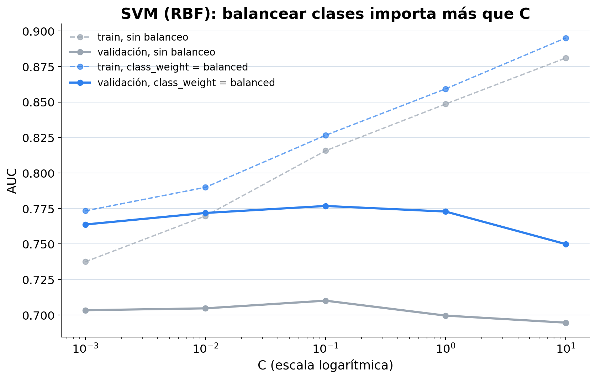

**Qué nos pasó:**

- Sin balancear, el AUC de validación queda en 0,70–0,71 con **cualquier** `C`.
- Con `class_weight = balanced`, sube a **0,777**. Este mecanismo es conocimiento general, no está en las diapositivas. Cada error se multiplica por `n / (2 · n_clase)`: 4,44 para un positivo y 0,56 para un negativo, unas **7,9 veces** más caro equivocarse con un positivo. Sin eso, con 11 % de positivos y clases superpuestas, el margen favorece a la mayoritaria.
- `C` grande sube el AUC de train (0,895 con `C = 10`) y baja validación (0,750): sobreajuste.
- Con `C = 0,1` balanceado, el kernel polinómico (0,777) empata con RBF y le gana al lineal (0,769).

### 8.4 Random Forest: muchos árboles distintos que votan

> **Teoría: árbol.** Divide el espacio con preguntas binarias y en cada nodo elige el corte de menor impureza (Gini o entropía). [T07, p. 4] [T07, p. 6] [T07, p. 12] Maneja numéricas y categóricas y no necesita normalización. [T07, p. 26]
>
> **Teoría: Random Forest.** Cada árbol se entrena con una muestra **bootstrap** y, en cada corte, mira un subconjunto aleatorio de variables. Después votan. [T07, p. 56] [T07, p. 58] [T07, p. 59] La aleatoriedad hace que los árboles cometan errores distintos, y al combinarlos se atenúan. [T07, p. 62]

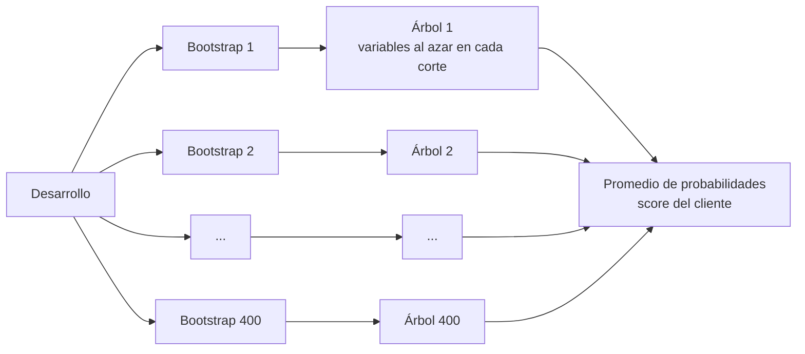

**Por qué ganó:** captura no linealidades, como la U de la edad, e interacciones entre el contexto y la historia del cliente, sin necesidad de escalar. Limitar la profundidad controló su sobreajuste (sección 9).

---

## 9. Ajuste de hiperparámetros: sobreajuste y subajuste

> **Teoría: curva de validación.** Grafica el rendimiento en train y en validación en función de un hiperparámetro de complejidad. Un gap grande indica sobreajuste. Un gap chico con rendimiento bajo indica subajuste. [T07, p. 50]

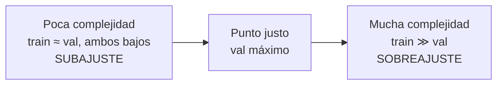

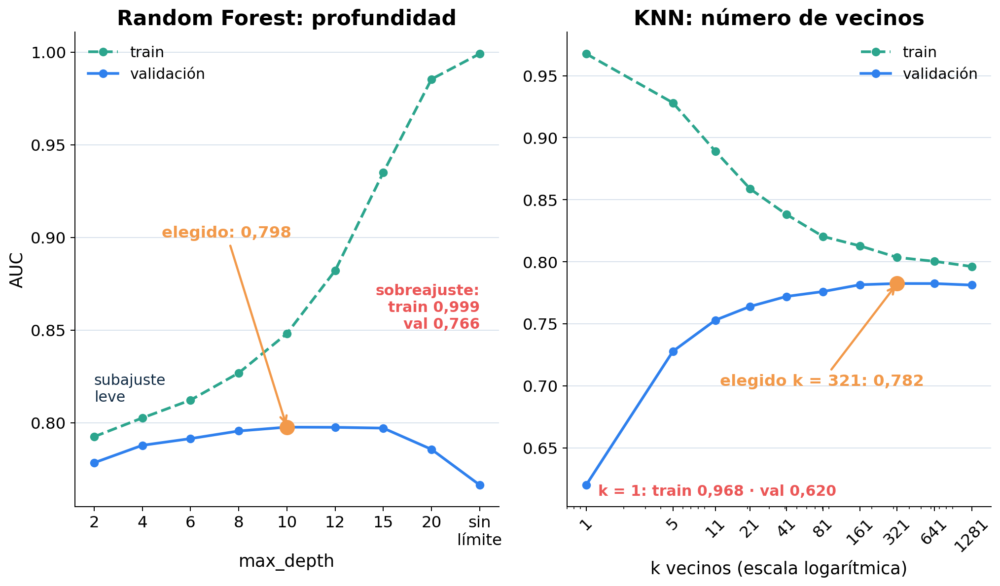

| Modelo | Hiperparámetro | Subajuste | Sobreajuste | Elegido |
|---|---|---|---|---|
| RF | `max_depth` | Profundidad 2: train 0,792, val 0,778 | Sin límite: train 0,999, val 0,766 | **10** (val 0,798) |
| RF | `n_estimators` | 10 árboles: 0,792 | — (más árboles no sobreajustan; se estabiliza) | **400** (0,798) |
| KNN | `k` | — (con `k` muy grande se aplana) | `k = 1`: train 0,968, val 0,620 | **321**, uniforme (0,782) |
| SVM | `C`, balanceo, kernel | `C = 0,001`: 0,764 | `C = 10`: train 0,895, val 0,750 | **`C = 0,1`**, balanceado, polinómico (0,777) |

**Cómo se lee la complejidad en cada modelo:** en RF sube con la profundidad; en KNN **baja** al aumentar `k` (frontera más suave); en SVM sube con `C` (se toleran menos errores).

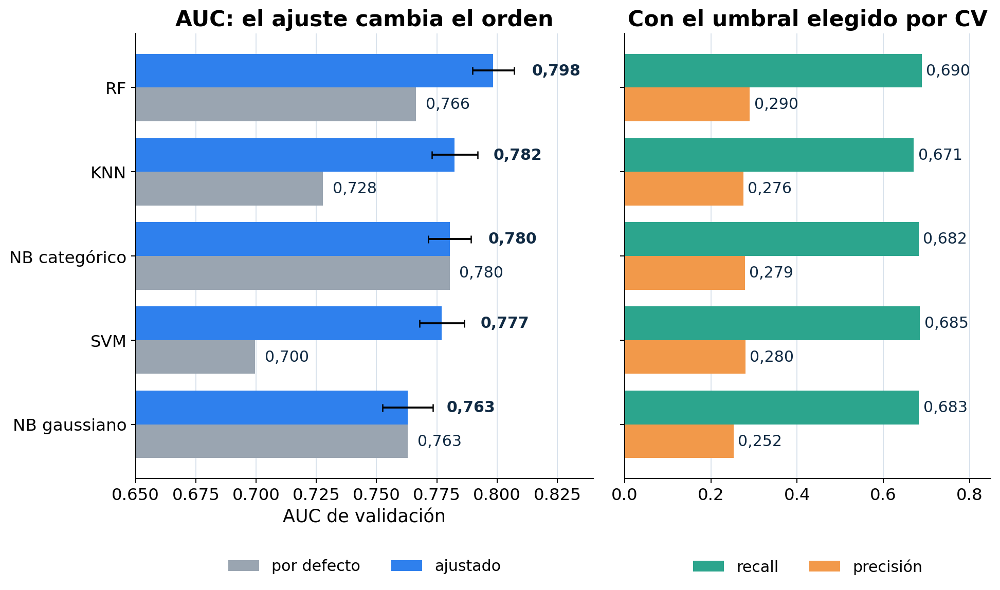

---

## 10. Modelo final y evaluación en test

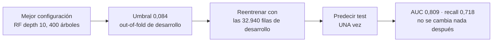

> **Teoría.** Elegido el modelo, se reentrena con todo desarrollo y se evalúa en test. [T02, p. 88] Test solo sirve para estimar el error en datos nuevos, nunca para decidir. [T02, p. 89]

| Métrica | Desarrollo (CV) | Test | IC 95 % bootstrap |
|---|---:|---:|---:|
| AUC | 0,798 | **0,809** | 0,791 – 0,826 |
| Recall | 0,690 | **0,718** | 0,691 – 0,746 |
| Precisión | 0,290 | 0,300 | 0,281 – 0,317 |

**Bootstrap** (conocimiento general): remuestreamos con reposición las 8.236 filas de test 1.000 veces y recalculamos las métricas sin reentrenar. El rango entre los percentiles 2,5 y 97,5 muestra cuánto puede variar la estimación por azar. Es la misma idea de muestreo con reemplazo que usa Random Forest. [T07, p. 56]

**¿Por qué test dio mejor que la CV?** 0,809 contra 0,798 está dentro de la variabilidad: el intervalo incluye 0,798. No significa que el modelo "mejoró".

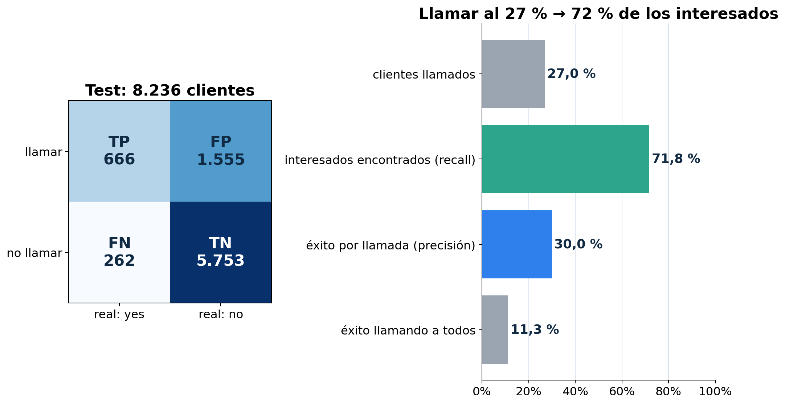

**Traducción al problema:**

- Llamando al **27 %** de los clientes se encuentra al **72 %** de los interesados.
- El 30 % de las llamadas tiene éxito, contra 11,3 % llamando a todos: **2,66 veces más**.
- Por cada contratación hay 2,3 llamadas fallidas, contra 7,9 llamando a todos.

---

## 11. La limitación principal: el modelo aprende el período

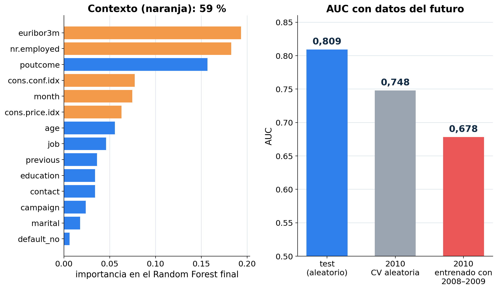

> **Teoría: importancia en Random Forest.** Suma la reducción de impureza que produce cada variable en los cortes donde se usa. [T07, p. 71] Como conocimiento general: tiende a favorecer a las numéricas con muchos valores, así que el orden es orientativo.

Las cuatro variables macro y `month` suman el **59 %** de la importancia. En parte, el modelo aprende *cuándo* se hizo la llamada, no solo *a quién* se llamó.

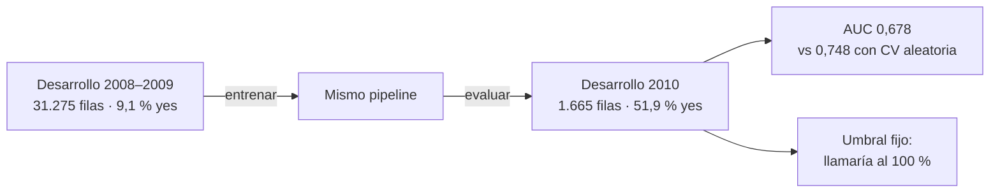

**Por qué pasa.** `nr.employed` en 2010 toma valores que **nunca** aparecieron en 2008–2009 (100 % de las filas fuera de rango). Un árbol no extrapola: manda esos valores a la hoja del tramo más cercano que conoce, que es el de 2009, con tasas altas. Por eso todos los clientes de 2010 superan el umbral.

**Para la defensa:** "Nuestra estimación vale para clientes como los de 2008 a 2010. Para una campaña futura habría que validar temporalmente y reentrenar."

---

## 12. Conclusiones en una tabla

| Modelo | AUC val | Por qué rindió así | Supuesto o propiedad clave |
|---|---:|---|---|
| Random Forest | **0,798** | Captura no linealidades e interacciones; limitar la profundidad controla el sobreajuste. | No necesita escalar ni normalidad. [T07, p. 26] |
| KNN | 0,782 | Clases muy superpuestas: necesita `k` enorme. | Continuidad local y escala comparable; sufre la dimensionalidad (46 columnas). [T09, p. 9] [T09, p. 39] |
| NB categórico | 0,780 | Simple y estable; casi sin gap. | Independencia condicional, violada por la correlación entre variables macro. [T06, p. 38] |
| SVM | 0,777 | Dependía del balanceo de clases. | Escala comparable; sensible al desbalance (conocimiento general). [T08, p. 54] |
| NB gaussiano | 0,763 | Normalidad violada por las binarias. | Normal por clase, covarianza diagonal. [T06, p. 32] |

**Errores relevantes.** FN = depósito perdido; FP = llamada fallida. Elegimos el umbral con un criterio geométrico. [T04, p. 52] Con los costos reales del banco convendría elegirlo por costo. [T04, p. 41]

**Mejoras.** Validación temporal y reentrenamiento periódico, umbral por costo o por capacidad de llamadas, más información previa a la llamada y probabilidades calibradas.

---

## 13. Autoevaluación

1. ¿Por qué nuestro modelo tiene menos accuracy que "siempre no" y aun así es mejor?

Accuracy 77,9 % contra 88,7 %. "Siempre no" acierta mucho porque el 88,7 % son negativos, pero no encuentra a nadie (recall 0). Nuestro modelo sacrifica aciertos en negativos para encontrar al 72 % de los interesados, que es el objetivo del negocio. [T04, p. 26]

2. ¿Qué pasaría si estandarizáramos con todo desarrollo antes de la validación cruzada?

La media y el desvío incluirían datos de cada fold de validación: es leakage. [T02, p. 94] Con 33 mil filas el efecto numérico sería chico, pero el procedimiento sería incorrecto, y con otras transformaciones (como la selección de variables) el sesgo puede ser grande.

3. ¿Por qué el umbral 0,084 no "contamina" la estimación de test?

Porque se eligió con las predicciones out-of-fold de desarrollo y se congeló antes de abrir test. Test solo se usó para medir.

4. ¿Por qué KNN con ponderación por distancia tiene AUC de train 0,999?

Cada punto de train es su propio vecino a distancia 0, con peso máximo. El modelo memoriza train, y eso no dice nada de su capacidad de generalizar.

5. ¿Por qué balancear clases cambia tanto a SVM y casi nada a Naive Bayes?

En SVM, los pesos cambian dónde queda el hiperplano: un error en un positivo cuesta 7,9 veces más. En Naive Bayes, el desbalance entra por el prior `P(y)`, que multiplica a todos los clientes por la misma constante. Cambiarlo mueve el umbral, pero no el orden de los clientes, así que no cambia el AUC. Esto último es una inferencia a partir de la regla de Bayes. [T06, p. 16]

6. Si `nr.employed` y `euribor3m` tienen correlación 0,94, ¿por qué conservamos las dos?

Porque la validación cruzada mostró que agregar `nr.employed` mejora a Naive Bayes (+0,007 y +0,004) sin perjudicar a los demás. La correlación alta no implica información idéntica.

7. ¿Qué indica una curva de validación donde train sube y validación baja?

Sobreajuste: el modelo aprende particularidades de train que no se repiten. En nuestro RF, validación empieza a caer a partir de profundidad 15 (0,797 con 15, 0,786 con 20) mientras train sigue subiendo; sin límite, train da 0,999 y validación 0,766. [T07, p. 50]

8. ¿Qué cambiaría si el banco solo pudiera hacer 1.000 llamadas por campaña?

El umbral se elegiría por capacidad: llamar a los 1.000 clientes con mayor score. El AUC sigue siendo la métrica adecuada, porque mide la calidad de ese orden, pero el recall y la precisión pasarían a medirse en ese punto de operación.

9. ¿Por qué el modelo falla en 2010 si en test anduvo bien?

Test mezcla los tres años igual que desarrollo, así que el modelo ya vio el "régimen" de cada período. En 2010 aparecen valores macro nunca vistos y una tasa de éxito cinco veces mayor. Los árboles no extrapolan y el umbral queda desajustado.

10. ¿Por qué el AUC de 0,938 con `duration` no se puede presentar como resultado?

Porque `duration` se conoce después de la llamada. En el momento de decidir a quién llamar, esa variable no existe. Es leakage. [D03]

---

## Material relacionado

- Consigna: [TP2: clasificación supervisada](../temas/tp2-clasificacion.md).
- Teoría: [Métricas de clasificación](../temas/metricas-de-clasificacion.md), [Evaluación y validación](../temas/evaluacion-y-validacion.md), [GDA y Naive Bayes](../temas/gda-y-naive-bayes.md), [kNN](../temas/aprendizaje-basado-en-instancias.md), [Máquinas de vectores de soporte](../temas/svm.md), [Árboles de decisión](../temas/arboles-de-decision.md) y [Ensambles y Random Forest](../temas/ensambles-random-forest.md).
- Entrega: notebook, `decisiones.md`, presentación y `guion_defensa.md` en `entregas/tp2-bank-marketing/`.
